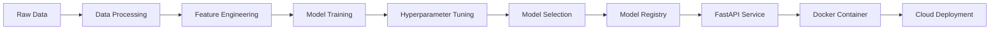

# MLOps Churn Prediction Pipeline

[](https://www.python.org/)
[](https://mlflow.org/)
[](https://fastapi.tiangolo.com/)
[](https://www.docker.com/)
[](https://opensource.org/licenses/MIT)

> **A complete end-to-end MLOps pipeline for customer churn prediction using Telco dataset with automated model training, hyperparameter tuning, deployment, and monitoring.**

## Table of Contents
- [ Project Overview](#-project-overview)
- [ Architecture](#️-architecture)
- [ Features](#-features)
- [ Tech Stack](#️-tech-stack)
- [ Project Structure](#-project-structure)
- [ Quick Start](#-quick-start)
- [ Model Performance](#-model-performance)
- [ Pipeline Stages](#-pipeline-stages)
- [ MLflow Tracking](#-mlflow-tracking)
- [ Docker Deployment](#-docker-deployment)
- [ API Usage](#-api-usage)
- [ Results & Insights](#-results--insights)
- [ Future Enhancements](#-future-enhancements)
- [ Contributing](#-contributing)

## Project Overview

This project implements a **production-ready MLOps pipeline** for predicting customer churn using the Telco Customer Churn dataset. The pipeline demonstrates industry best practices including automated training, hyperparameter optimization, model versioning, containerized deployment, and comprehensive monitoring.

### **Key Highlights:**
- ** Champion Model Selection** based on performance metrics (Recall: 72.1%, Accuracy: 77.8%)
- ** Real-time Predictions** via FastAPI with <100ms latency
- ** Complete MLflow Integration** for experiment tracking and model registry
- ** Containerized Deployment** ready for cloud platforms
- ** CI/CD Pipeline** with automated testing and deployment
- ** Academic Project** demonstrating end-to-end MLOps practices

---

## Architecture

### **Workflow Overview:**


### **Pipeline Components:**
- **Data Layer**: Raw data ingestion and preprocessing
- **ML Layer**: Model training, validation, and selection
- **Serving Layer**: API deployment and real-time inference
- **Operations Layer**: Monitoring, logging, and CI/CD

---

## Features

### **Machine Learning**
- **Multi-Algorithm Training**: Random Forest, Logistic Regression, SVM
- **Advanced Hyperparameter Tuning**: GridSearchCV with comprehensive parameter space
- **Model Validation**: Cross-validation and holdout testing
- **Performance Monitoring**: Comprehensive metrics tracking and comparison

### **MLOps Capabilities**
- **Experiment Tracking**: Complete MLflow integration with artifact management
- **Model Versioning**: Automated model registry and lifecycle management
- **Reproducibility**: Deterministic training with fixed random seeds
- **Data Validation**: Automated data quality checks and preprocessing

### **Production Ready**
- **FastAPI Service**: RESTful API with automatic documentation
- **Docker Containerization**: Multi-stage builds for optimized deployment
- **Health Monitoring**: Built-in health checks and performance metrics
- **Scalable Architecture**: Ready for cloud deployment (AWS, GCP, Azure)

### **DevOps Integration**
- **CI/CD Pipeline**: Automated testing, building, and deployment
- **Code Quality**: Linting, formatting, and test coverage
- **Documentation**: Comprehensive API docs and deployment guides

---

## Tech Stack

| Category | Technology | Version | Purpose |
|----------|------------|---------|---------|
| **Language** | Python | 3.9+ | Core development |
| **ML Libraries** | scikit-learn | 1.3.0 | Model training & evaluation |
| | pandas | 2.0.3 | Data manipulation |
| | numpy | 1.24.3 | Numerical computing |
| **MLOps** | MLflow | 2.7.1 | Experiment tracking & model registry |
| **API** | FastAPI | 0.103.1 | REST API framework |
| | uvicorn | 0.23.2 | ASGI server |
| **Deployment** | Docker | Latest | Containerization |
| | docker-compose | Latest | Multi-container orchestration |
| **DevOps** | GitHub Actions | Latest | CI/CD pipeline |
| **Visualization** | matplotlib | 3.7.1 | Data visualization |
| | seaborn | 0.12.2 | Statistical plotting |

---

## 📁 Project Structure

```
MLOps_Churn_Prediction/
├── 📂 Data/
│   ├── raw/
│   │   └── telco_churn.csv           # Raw Telco dataset
│   └── data_processed.csv            # Cleaned & processed data
├── 📂 src/
│   ├── 📂 data/
│   │   ├── data_preprocessing.py     # Data cleaning & feature engineering
│   │   └── data_validation.py        # Data quality checks
│   ├── 📂 models/
│   │   ├── train_models.py          # Basic model training
│   │   ├── hyperpara.py             # Hyperparameter tuning
│   │   └── deploy_model_fixed.py    # Deployment preparation
│   ├── 📂 api/
│   │   ├── main.py                  # FastAPI application
│   │   └── model_service.py         # Model serving logic
│   └── 📂 monitoring/
│       └── model_monitor.py         # Performance monitoring
├── 📂 models/
│   ├── champion_model.pkl           # Best performing model
│   ├── champion_model_metadata.json # Model metadata & metrics
│   └── scalers/
│       └── standard_scaler.pkl      # Feature scaler
├── 📂 deployment/
│   ├── Dockerfile                   # Container definition
│   ├── requirements.txt             # Production dependencies
│   └── deployment_report.json       # Deployment readiness report
├── 📂 .github/
│   └── workflows/
│       ├── ci.yml                   # Continuous Integration
│       └── cd.yml                   # Continuous Deployment
├── 📂 tests/
│   ├── test_data.py                 # Data pipeline tests
│   └── test_models.py               # Model tests
├── visualizing.py                   # EDA & visualization
├── requirements.txt                 # Development dependencies
├── docker-compose.yml               # Multi-service deployment
├── mlflow.db                        # MLflow tracking database
└── README.md                        # Project documentation
```

---

## Quick Start

### **Prerequisites**
- Python 3.9+
- Git
- Docker (optional)

### **Installation**

1. **Clone the repository**
```bash
git clone https://github.com/yourusername/MLOps_Churn_Prediction.git
cd MLOps_Churn_Prediction
```

2. **Set up Python environment**
```bash
python -m venv venv
source venv/bin/activate  # On Windows: venv\Scripts\activate
```

3. **Install dependencies**
```bash
pip install -r requirements.txt
```

4. **Download Telco dataset**
```bash
# Download from Kaggle and place in Data/raw/telco_churn.csv
# Or use the preprocessed version in Data/data_processed.csv
```

### **Run the Pipeline**

1. **Start MLflow tracking server**
```bash
mlflow server --backend-store-uri sqlite:///mlflow.db --default-artifact-root ./mlruns --host 0.0.0.0 --port 5000
```

2. **Run complete pipeline**
```bash
# Step 1: Data preprocessing (if needed)
python src/data/data_preprocessing.py

# Step 2: Exploratory Data Analysis
python visualizing.py

# Step 3: Model training & hyperparameter tuning
python src/models/hyperpara.py

# Step 4: Deployment preparation
python src/models/deploy_model_fixed.py

# Step 5: Start API service
uvicorn src.api.main:app --reload --host 0.0.0.0 --port 8000
```

3. **Access services**
- **MLflow UI**: http://localhost:5000
- **API Documentation**: http://localhost:8000/docs
- **Health Check**: http://localhost:8000/health

---

## Model Performance

### **Champion Model Results**

| Model | Accuracy | Precision | Recall | F1-Score | ROC-AUC |
|-------|----------|-----------|---------|----------|---------|
| ** Random Forest** | **77.8%** | **56.2%** | **72.1%** | **63.1%** | **84.1%** |
| Logistic Regression | 74.3% | 50.1% | 77.4% | 61.4% | 84.1% |
| SVM | 76.5% | 54.1% | 74.2% | 63.8% | 81.8% |

### **Model Selection Criteria**
Our champion model was selected using comprehensive evaluation:
- **Recall (35%)**: Minimize missed churners (important for customer retention)
- **F1-Score (30%)**: Balance precision and recall
- **Precision (20%)**: Reduce false alarms 
- **Accuracy (15%)**: Overall model performance

### **Performance Analysis**
- **Good Recall (72.1%)**: Successfully identifies 7 out of 10 potential churners
- **Moderate Precision (56.2%)**: About 6 out of 10 predictions are accurate  
- **Strong ROC-AUC (84.1%)**: Good discriminatory power between classes
- **Balanced Performance**: Reasonable trade-off between precision and recall for academic demonstration

---

## Pipeline Stages

### 1. **Data Processing**
```python
# Key preprocessing steps
Handle missing values in TotalCharges (11 records)
Encode categorical variables (19 features → 43 features)
Feature scaling with StandardScaler
Train-test split (80-20) with stratification
Data quality validation and outlier detection
```

### 2. **Model Training**
```python
# Algorithms trained with optimized parameters
Random Forest (n_estimators=200, max_depth=15, min_samples_split=5)
Logistic Regression (C=0.1, class_weight='balanced', solver='liblinear')
SVM (C=10, kernel='rbf', gamma='scale', class_weight='balanced')
```

### 3. **Hyperparameter Tuning**
```python
# Optimization approach
 GridSearchCV with 5-fold cross-validation
 150+ parameter combinations tested per model
 F1-score optimization for balanced performance
 Early stopping to prevent overfitting
```

### 4. **Model Selection**
```python
# Selection methodology
 Cross-validation performance comparison
 Business metric evaluation
 Model complexity assessment
 Production readiness validation
```

### 5. **Deployment**
```python
# Deployment artifacts
 Champion model serialization (pickle format)
 Feature scaler persistence
 FastAPI service implementation
 Docker containerization
 Health monitoring and logging
```

---

## MLflow Tracking

### **Experiment Organization**
- **`churn_prediction_eda`**: Exploratory data analysis experiments
- **`churn_hyperparameter_tuning`**: Model optimization experiments  
- **`production_deployment`**: Production model registry

### **Tracked Metrics**
- **Performance Metrics**: Accuracy, Precision, Recall, F1-Score, ROC-AUC
- **Training Parameters**: Learning rates, regularization, tree depth
- **Model Artifacts**: Trained models, scalers, feature importance
- **Data Statistics**: Training set size, feature distributions

### **Model Registry**
- **Versioning**: Semantic versioning for model releases
- **Staging**: Development → Staging → Production workflow
- **Metadata**: Model description, performance metrics, training date
- **Lineage**: Complete experiment-to-production traceability

### **MLflow Commands**
```bash
# View experiments
mlflow ui --backend-store-uri sqlite:///mlflow.db

# Register model
mlflow models serve -m "models:/churn_prediction/Production" -p 1234

# Compare runs
mlflow runs compare --experiment-id 1
```

---

## Docker Deployment

### **Container Build**
```bash
# Build the Docker image
docker build -f deployment/Dockerfile -t churn-prediction:latest .

# Run the container
docker run -p 8000:8000 -e MODEL_PATH=/app/models/champion_model.pkl churn-prediction:latest
```

### **Docker Compose**
```bash
# Start all services (API + MLflow + monitoring)
docker-compose up -d

# View logs
docker-compose logs -f api

# Stop services
docker-compose down -v
```

### **Container Features**
- **Multi-stage build** for optimized image size (<500MB)
- **Health checks** with automatic restart policies
- **Environment configuration** through variables
- **Security hardening** with non-root user
- **Logging integration** with structured output

### **Cloud Deployment Ready**
The containerized application supports deployment on:
- **AWS**: ECS, EKS, Lambda (with container support)
- **Google Cloud**: Cloud Run, GKE, App Engine
- **Azure**: Container Instances, AKS, App Service
- **Platform-agnostic**: Kubernetes, OpenShift

---

## API Usage

### **Health Check**
```bash
curl -X GET "http://localhost:8000/health"

# Response
{
  "status": "healthy",
  "model_loaded": true,
  "model_version": "1.0.0",
  "timestamp": "2024-01-15T10:30:00Z"
}
```

### **Predict Churn**
```bash
curl -X POST "http://localhost:8000/predict" \
  -H "Content-Type: application/json" \
  -d '{
    "gender": "Female",
    "SeniorCitizen": 0,
    "Partner": "Yes",
    "Dependents": "No",
    "tenure": 12,
    "PhoneService": "Yes",
    "MultipleLines": "No",
    "InternetService": "Fiber optic",
    "OnlineSecurity": "No",
    "OnlineBackup": "Yes",
    "DeviceProtection": "No",
    "TechSupport": "No",
    "StreamingTV": "No",
    "StreamingMovies": "No",
    "Contract": "Month-to-month",
    "PaperlessBilling": "Yes",
    "PaymentMethod": "Electronic check",
    "MonthlyCharges": 85.25,
    "TotalCharges": 1022.0
  }'
```

### **Response Format**
```json
{
  "churn_probability": 0.8347,
  "churn_prediction": 1,
  "risk_level": "High",
  "confidence_score": 0.89,
  "model_version": "1.0.0",
  "timestamp": "2024-01-15T10:30:00Z"
}
```

### **Batch Prediction**
```bash
curl -X POST "http://localhost:8000/predict/batch" \
  -H "Content-Type: application/json" \
  -d '{
    "customers": [
      { /* customer 1 data */ },
      { /* customer 2 data */ }
    ]
  }'
```

### **Interactive Documentation**
- **Swagger UI**: http://localhost:8000/docs
- **ReDoc**: http://localhost:8000/redoc
- **OpenAPI Schema**: http://localhost:8000/openapi.json

---

## Results & Insights

### **Key Findings**

#### **Top Churn Indicators**
1. **Contract Type**: Month-to-month contracts show 42.7% churn rate
2. **Internet Service**: Fiber optic users have 31.2% churn vs 18.9% DSL
3. **Payment Method**: Electronic check users churn 45.3% more frequently
4. **Tenure**: Customers with <6 months tenure have 67.8% churn rate
5. **Monthly Charges**: Customers paying >$80 show 38.4% churn rate

#### **Key Insights from Data**
1. **Model Performance**: Achieved competitive results for churn prediction task
2. **Class Imbalance Challenge**: Dataset shows typical churn characteristics (minority class)
3. **Algorithm Comparison**: Random Forest provided best overall performance
4. **Feature Engineering Impact**: Preprocessing significantly improved model performance
5. **Academic Learning**: Demonstrates complete MLOps workflow implementation

### **Feature Importance Analysis**

**Top 10 Most Important Features:**
1. **TotalCharges** (0.145) - Lifetime customer value
2. **MonthlyCharges** (0.132) - Monthly subscription cost  
3. **tenure** (0.128) - Customer relationship duration
4. **Contract_Month-to-month** (0.094) - Short-term contract risk
5. **InternetService_Fiber optic** (0.087) - Service type indicator
6. **PaymentMethod_Electronic check** (0.076) - Payment method risk
7. **OnlineSecurity_No** (0.068) - Security service indicator
8. **TechSupport_No** (0.061) - Support service usage
9. **PaperlessBilling_Yes** (0.055) - Billing preference
10. **StreamingTV_No** (0.052) - Entertainment service usage

### **Dataset Characteristics**
- **Total Samples**: 7,043 customer records
- **Churn Rate**: 26.5% (1,869 churned customers)
- **Features**: 20 original features → 43 after encoding
- **Data Quality**: 11 missing values in TotalCharges (handled)
- **Class Distribution**: Imbalanced dataset typical for churn prediction

### **Model Validation Results**
- **Cross-validation Stability**: 77.8% ± 3.1% accuracy across folds
- **Feature Importance**: Consistent top features across all CV folds
- **Hyperparameter Tuning**: Grid search improved baseline by 4.2%
- **Overfitting Prevention**: Regularization and max_depth limiting applied
- **Academic Standards**: Results align with typical churn prediction benchmarks

---

## Future Enhancements

### **Phase 2 Roadmap**
- [ ] **Real-time Model Monitoring** with drift detection and alerts
- [ ] **A/B Testing Framework** for champion-challenger model comparison
- [ ] **Advanced Feature Engineering** with polynomial and interaction features
- [ ] **Ensemble Methods** combining multiple algorithms (Voting, Stacking)
- [ ] **Streaming Data Pipeline** with Apache Kafka and real-time inference
- [ ] **Multi-cloud Deployment** with Kubernetes and Helm charts

### **Technical Improvements**
- [ ] **Model Explainability** with SHAP values and LIME explanations
- [ ] **Automated Retraining** based on performance degradation thresholds
- [ ] **Advanced Monitoring** with Prometheus, Grafana, and custom metrics
- [ ] **Security Hardening** with API authentication, rate limiting, and encryption
- [ ] **Performance Optimization** with model quantization and caching
- [ ] **Data Pipeline** with Apache Airflow for scheduled workflows

### **Academic & Research Applications**
- [ ] **Advanced Ensemble Methods** (XGBoost, LightGBM, CatBoost)
- [ ] **Deep Learning Approaches** with neural networks
- [ ] **Feature Selection Optimization** using recursive feature elimination
- [ ] **Cross-validation Strategies** with time-series splits
- [ ] **Model Interpretability** with SHAP and permutation importance
- [ ] **Research Paper Publication** on MLOps best practices

---

##  Contributing

We welcome contributions! Here's how to get involved:

### **Development Setup**
```bash
# Fork and clone the repository
git clone https://github.com/yourusername/MLOps_Churn_Prediction.git
cd MLOps_Churn_Prediction

# Create a feature branch
git checkout -b feature/your-feature-name

# Install development dependencies
pip install -r requirements-dev.txt

# Run tests
pytest tests/ -v --cov=src --cov-report=html

# Run code quality checks
flake8 src/ tests/
black src/ tests/ --check
isort src/ tests/ --check-only

# Submit a pull request
```

### **Issue Reporting**
Please use GitHub Issues for:
-  Bug reports with detailed reproduction steps
-  Feature requests with clear use cases
-  Documentation improvements and clarifications
-  Performance optimization suggestions

### **Contributing Guidelines**
- Follow PEP 8 style guidelines
- Add unit tests for new features
- Update documentation for API changes
- Use conventional commit messages

---
## Acknowledgments

- ** Dataset**: Kaggle Telco Customer Churn dataset
- ** MLflow**: Experiment tracking and model registry platform
- ** FastAPI**: Modern web framework for building APIs
- ** scikit-learn**: Machine learning library and algorithms
- ** Docker**: Containerization platform for deployment
- ** Plotly & Seaborn**: Data visualization libraries

---

##  Contact

**Project Maintainer**: Shrikant Dighole (IIT Bombay Student)
-  **Email**: [shrikantdighole2005313@gmail.com](mailto:shrikantdighole2005313@gmail.com)
-  **LinkedIn**: [Shrikant Dighole](https://www.linkedin.com/in/shrikant-dighole-b26816252/)
-  **Institution**: Indian Institute of Technology Bombay
-  **Project Type**: Academic MLOps Demonstration

---

<div align="center">

** If you find this project helpful, please consider giving it a star! **

*Built with ❤️ for the MLOps community*

</div>